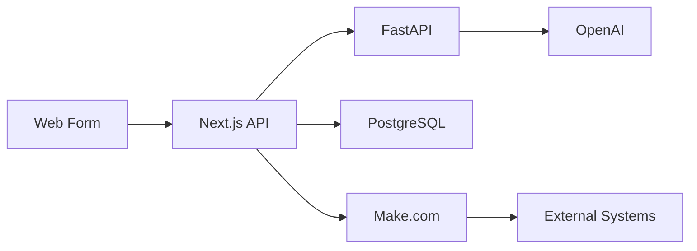

# IntelliSuite - AI-Powered Lead Qualification System

IntelliSuite is an advanced lead qualification platform that uses multi-agent AI to analyze, score, and prioritize sales leads. The system helps businesses focus their sales efforts on the most promising opportunities.

## 🚀 Features

### Advanced AI System
- Multi-agent AI processing using CrewAI
  - Lead Analyzer Agent: Evaluates lead information against scoring criteria
  - Market Researcher Agent: Provides industry and company context
  - Decision Maker Agent: Makes final qualification decisions
- Intelligent workflow orchestration
- Contextual analysis and reasoning
- Automated decision making

### Lead Scoring System
- 10-point scoring system based on:
  - Intent Level (4 points): Budget mentions, decision maker status, timeline urgency
  - Contact Info (3 points): Email validity, phone format, name completeness
  - Company/Message Quality (3 points): Company details, use case clarity, business scale
- Categorization into HOT, WARM, and COLD leads
- Detailed reasoning for each score
- Actionable recommendations based on lead quality


### Analytics Dashboard
- Lead conversion metrics
- Score trend analysis
- Category distribution
- Performance insights
- Real-time data visualization
- AI decision tracking

### Integrations
- Make.com webhook integration
- Email notifications
- CRM compatibility
- Extensible webhook system

## 🛠️ Tech Stack

### AI & Machine Learning
- CrewAI for multi-agent orchestration
  - Custom AI agents for specific tasks
  - Agent collaboration system
  - Dynamic task allocation
- LangChain for AI operations
  - Prompt management
  - Chain of thought processing
  - Context management
- OpenAI GPT integration
  - Advanced language processing
  - Intent analysis
  - Semantic understanding

### Frontend
- Next.js 13+ (React)
- TypeScript
- Tailwind CSS
- Chart.js for analytics
- Real-time data updates

### Backend
- FastAPI (Python)
- LangChain for AI orchestration
- CrewAI agent system
- Prisma ORM
- PostgreSQL database

### DevOps & Tools
- Environment configuration
- Error handling & logging
- Make.com automation
- Type-safe development

## 📊 System Architecture



## 🚀 Getting Started

### Prerequisites
- Node.js 18+
- Python 3.8+
- PostgreSQL
- OpenAI API key
- Make.com account (optional)

### Installation

1. Clone the repository
```bash
git clone https://github.com/yourusername/intellisuite.git
cd intellisuite
```

2. Install frontend dependencies
```bash
cd frontend
npm install
```

3. Install backend dependencies
```bash
cd backend
python -m venv venv
source venv/bin/activate  # On Windows: venv\Scripts\activate
pip install -r requirements.txt
```

4. Set up environment variables
```bash
# Frontend (.env)
cp .env.example .env
# Add your environment variables

# Backend (.env)
cp backend/.env.example backend/.env
# Add your OpenAI API key
```

5. Run database migrations
```bash
cd frontend
npx prisma migrate dev
```

6. Start the development servers
```bash
# Terminal 1 - Frontend
npm run dev

# Terminal 2 - Backend
cd backend
python app.py
```

## 🔧 Configuration

### Environment Variables
- `DATABASE_URL`: PostgreSQL connection string
- `OPENAI_API_KEY`: Your OpenAI API key
- `NEXT_PUBLIC_API_URL`: Backend API URL
- Additional webhook configurations

### Make.com Integration
1. Create a new scenario in Make.com
2. Add an HTTP webhook trigger
3. Configure the webhook URL in your environment

## 📈 Usage

### Lead Processing
1. Submit leads through the web form
2. AI automatically qualifies leads
3. View results in the analytics dashboard
4. Automated notifications via Make.com

### Analytics
- Access the dashboard at `/dashboard/analytics`
- View lead trends and metrics
- Export data for reporting

## 🤝 Contributing
[Your contribution guidelines]

## 📝 License
[Your license information]

## 🌐 Deployment Options

### 1. Cloud-Hosted SaaS
- Fully managed solution hosted by us
- Instant setup with custom domain
- Automatic updates and maintenance
- Scalable infrastructure
- 24/7 monitoring

### 2. Self-Hosted Enterprise
- Deploy on client's infrastructure
- Full data control and privacy
- Custom integration support
- VPN/private network support
- On-premise database options

### 3. Hybrid Setup
- Frontend on client's domain
- Backend services managed by us
- Custom data retention policies
- Flexible integration options

## 💼 Service Tiers

### Starter Package
- Up to 100 leads/month
- Basic AI qualification
- Standard analytics
- Email notifications
- Single user access

### Business Package
- Up to 1000 leads/month
- Advanced AI qualification
- Custom scoring rules
- Full analytics suite
- Multi-user access
- Priority support
- CRM integration

### Enterprise Package
- Unlimited leads
- Custom AI training
- Advanced analytics
- White-label option
- Dedicated support
- Custom integrations
- SLA guarantee

## 🔒 Security & Compliance

### Data Protection
- End-to-end encryption
- Regular security audits
- GDPR compliance
- Data backup & recovery
- Access control

### Enterprise Features
- Single Sign-On (SSO)
- Role-based access
- Audit logging
- Custom data retention
- IP whitelisting

## 🤝 Implementation Process

1. **Discovery Phase**
   - Requirements gathering
   - System architecture review
   - Integration planning
   - Timeline establishment

2. **Setup & Configuration**
   - Environment setup
   - Database configuration
   - API key management
   - Webhook configuration

3. **Integration**
   - CRM system connection
   - Email system setup
   - Custom webhook setup
   - Data migration (if needed)

4. **Training & Onboarding**
   - Admin dashboard training
   - Lead qualification setup
   - Analytics configuration
   - User management setup

5. **Support & Maintenance**
   - 24/7 technical support
   - Regular updates
   - Performance monitoring
   - Ongoing optimization
